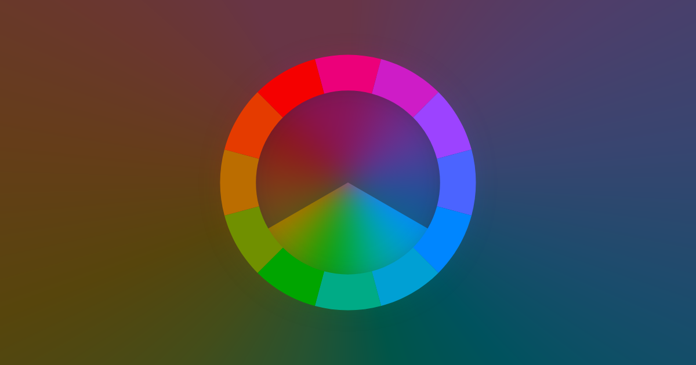

# tonewise



> A playful exploration of sound, color, and proportion

[tonewise.app](https://tonewise.app/)

## About

This is the source repository for [Tonewise](https://tonewise.app), an app I
made for playing with musical relationships.

I have a lot of things I'd like to do with it, but no timelines or anything like that. If there's something that you think would be cool to see in the app, [let me know](https://yusef.napora.org) or [open an issue](https://github.com/yusefnapora/tonewise/issues/new).

I'm afraid that if you rely on keyboard or other focus-driven input methods, you will not be able to use the main tone wheel component. Fixing this is high on my list of things to do, but please reach out if it would help you out and I haven't got to it yet.

I'm especially interested in your feedback if you perceive color differently than I do. I've tried to make the app accessible to people with color perceptual issues by adding alternative color palettes in the app settings, but there's no substitute for direct experience.

<!--

TODO: link to intro video / screenshots, etc

-->

### Demos

Click the image below for a quick video of me playing around with the app and installing it to my home screen:

[](https://www.youtube.com/watch?v=oJYA1k86ckM)

## License

This project is licensed under the [GNU General Public License, version 3](./LICENSE.txt), except where indicated otherwise.

In addition to dependencies pulled in via NPM,this repo includes "vendored" copies of a few bits of useful code, with some light modifications.

- [unmute-ios-audio](https://github.com/feross/unmute-ios-audio) (MIT license)
- [scale-color-perceptual](https://github.com/politiken-journalism/scale-color-perceptual) (ISC license)

## Local development

You'll need Node JS - I've been using v20, but any recent one should do. You'll also want a browser or two - there's a lot of SVG and CSS grid crimes in the code, so I try to test across the "big 3" (firefox, chromium, safari).

Install dependencies:

```shell
npm install
```

Run a dev server:

```shell
npm run serve
```

The app should show up at http://localhost:8000/src/

> note: if you go to just `http://localhost:8000/` you'll get an error message, so make sure to go to the `/src/` path.

Run tests (mostly just hello world so far):

```shell
npm run test
```

Open a new blank profile in Firefox or Chrome (useful for testing without your usual extensions, etc):

```shell
npm run firefox
# or:
npm run chrome
```

## Build

Build a production bundle:

```shell
npm run build
```

The output in `dist` can be served from any static site host.

To preview the production build, I usually just use python to pop up a server on port 3000:

```shell
python3 -m http.server 3000
```
